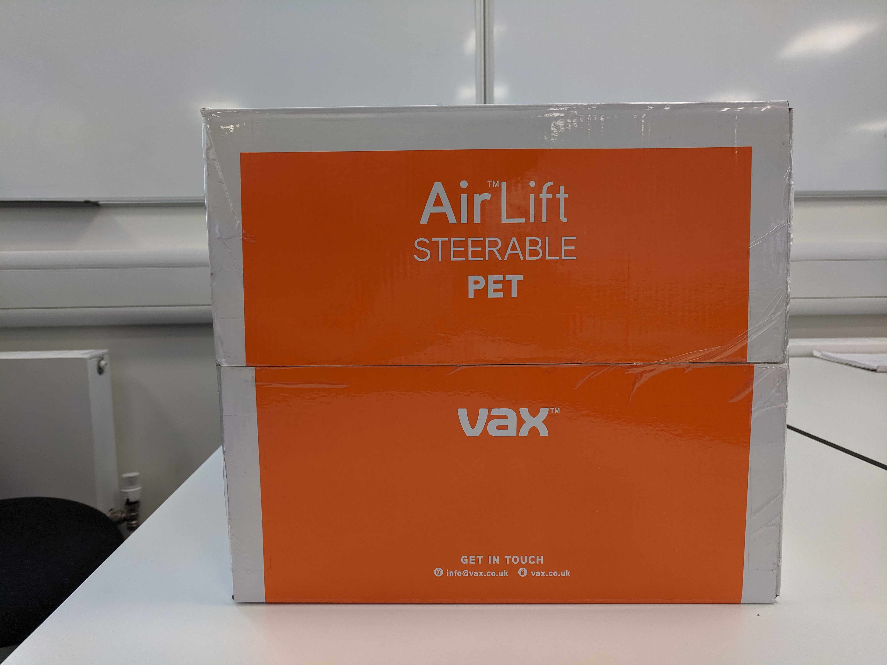
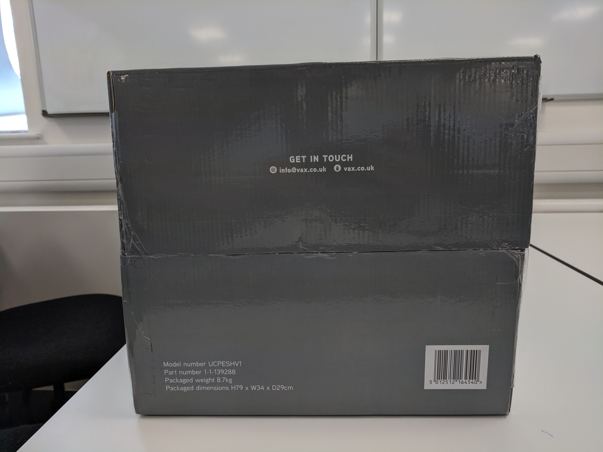
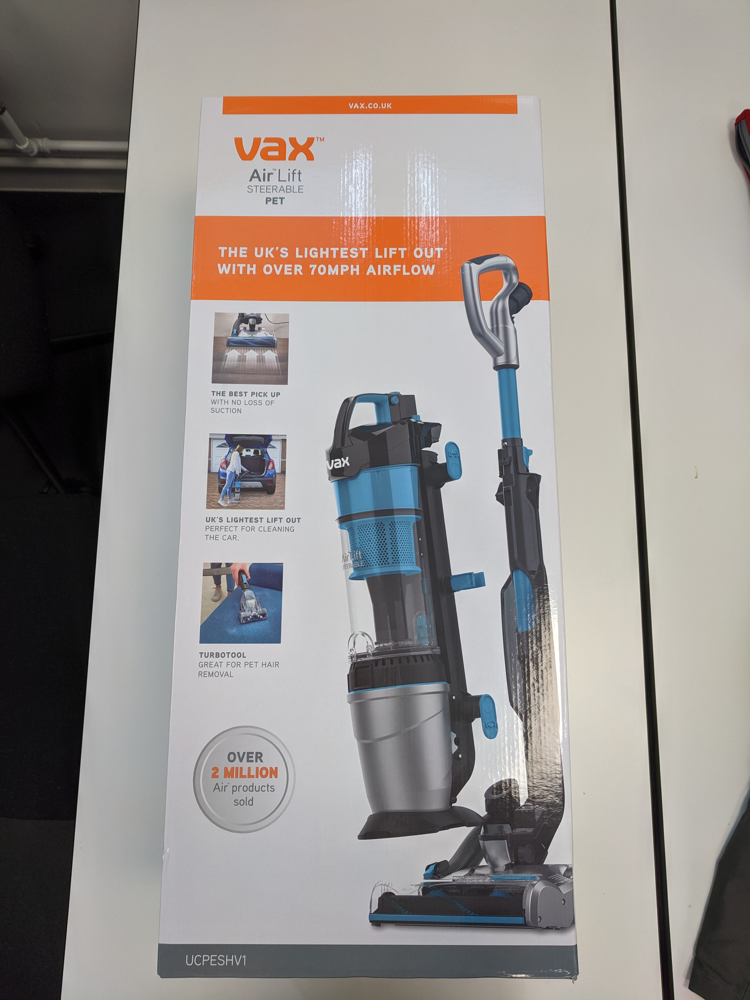
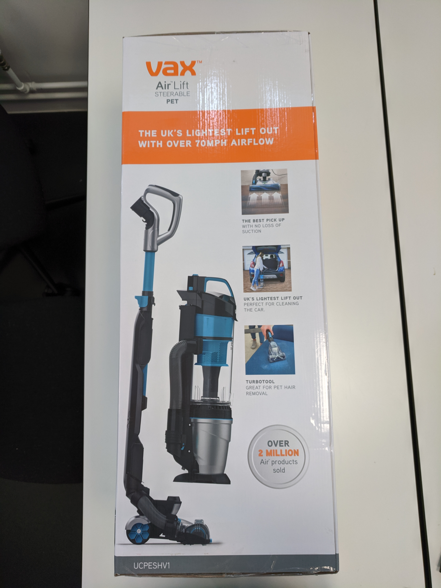
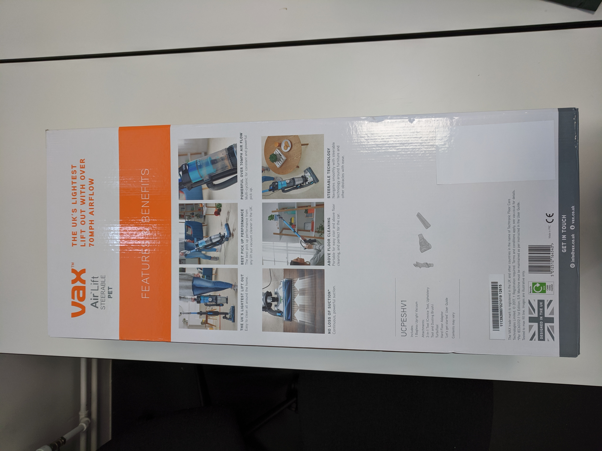

# Box

## Top

- Orange and bright, uses brand colours
- Name of product clearly visible
- Brand clearly visible
- Social links

## Bottom

- Does not stand out
- Social links
- Model and part number hidden
- Required facts including weight and dimensions
- Required barcode

## Side 1 (front)

- Orange branding
- Website link at top
- Large product image to show what the final product looks like
- Three demonstrations photos
- Brags - over 2m products sold, 'the best' and 'UK's lightest'
- Facts and figures - 70mph
- Model number small at bottom

## Side 2 and 3 (identical)

- Similar to front, same information given regardless of orientation

## Side 3 (back)

- Same branding as other sides
- Outlining features of the product (users are most likely to look at the back to find out more)
- Some of the same features as the other sides but several new features
- Images to visually indicate the purpose of each feature
- **Shows contents of the box with some diagrams to indicate what the list is indicating**
- Required trademark information
- **Design in the UK logo, fairly hidden but noticeable**
- **Made in PRC - not 'made in China'**
- Recycle icon
- Barcode and CE markings

## Overall Observations

- Not premium looking or feeling
- Full colour and glossy, aimed at retail market
- Cheap corrugated cardboard - no soft touch
- Visible tape holding box shut - possibly opened and returned but not necessarily
- No shrink wrap or other waterproof coating
- Damage level 1 or 2 out of 5, some bumps and scuffs
- Product rattles when box is moved
- No handle on box, not easy to transport (cheaper)
