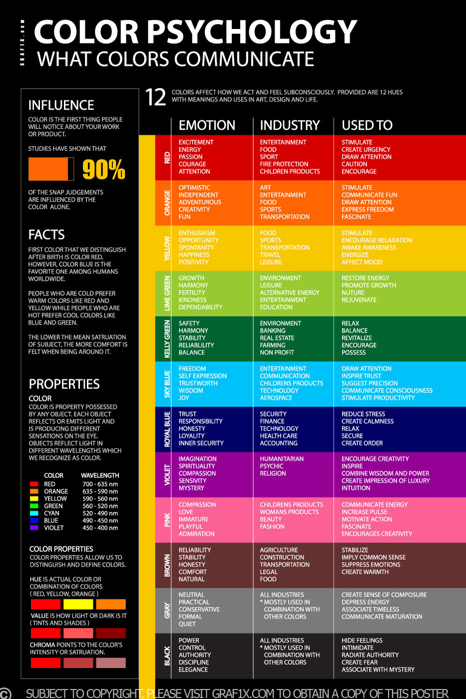

# Colour

## Colour Psychology
Source for (some of the) colour psychology notes that were added. Blue colour seems to just differentiate the different vacuums in VAX's range (other ones are pink and red), but VAX orange branding definitely has an effect on consumer purchasing.

I also wanted to make a relation to Dyson's colour scheme - as they have a very similar technique with mostly grey / black, some transparent elements, and an accent colour. It seems that VAX (along with several other manufacturers) have copied this aesthetic due to the appeal of Dyson product.

