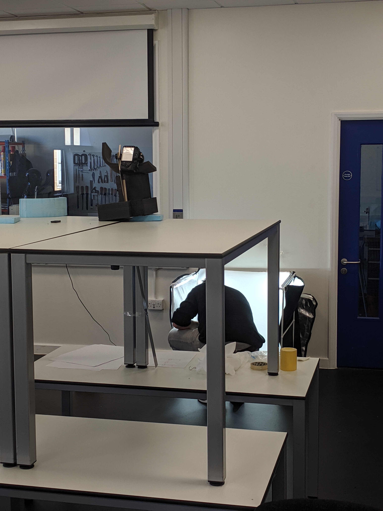
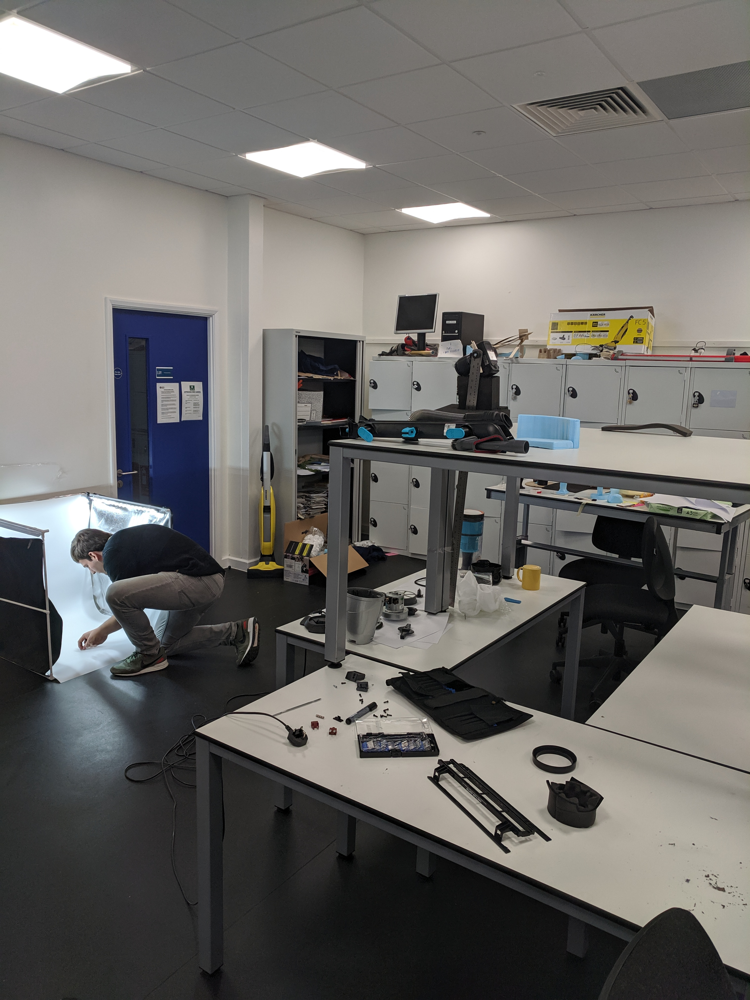
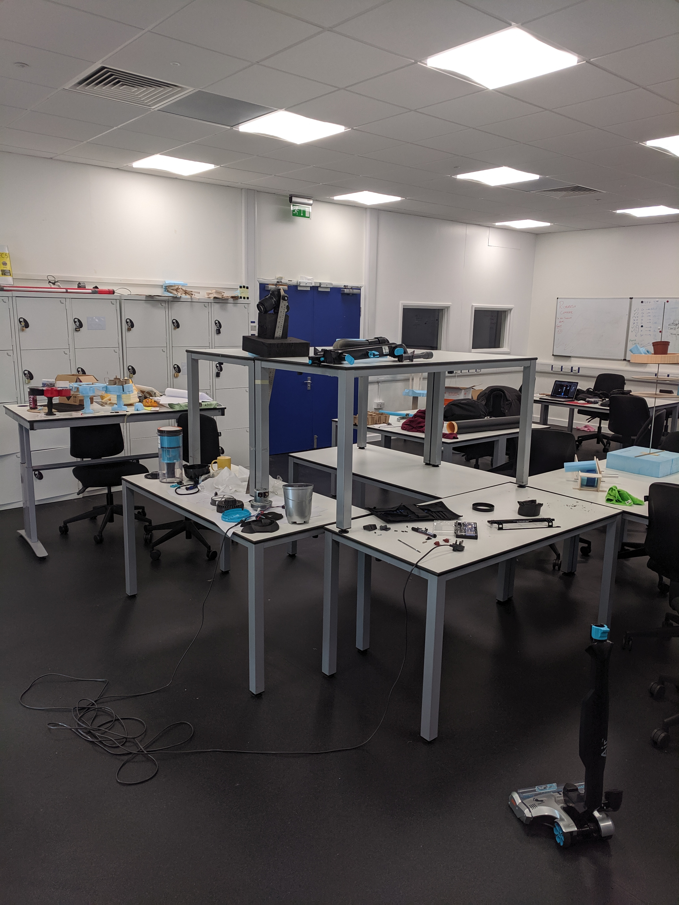

# Exploded diagram

My housemate had a tripod we could borrow... this weekend he was away and had locked his tripod in his room.

Each component was placed in the softbox and a photo was taken one at a time

Health and safety gone mad! Good thing we had our induction at the start of the year.

The resultant ~200 photos (I might have missed some screws...) were then colour graded and manually stitched together in Photoshop to create the final 120 megapixel image.

