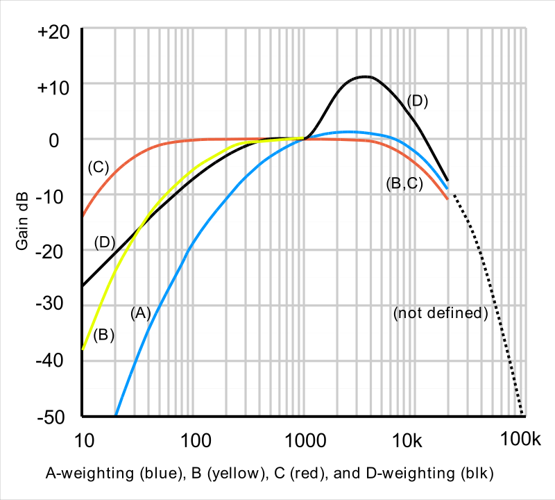

# Noise

Spectral analysis of audio can provide interesting insights often not revealed with standard volume measurements.

Although sound intensity is measured in dB, the human ear can only hear certain frequencies, and it hears some frequencies much louder than others. dBA is a measure of perceived loudness by the human ear, using [A-weighting](https://en.wikipedia.org/wiki/A-weighting)

