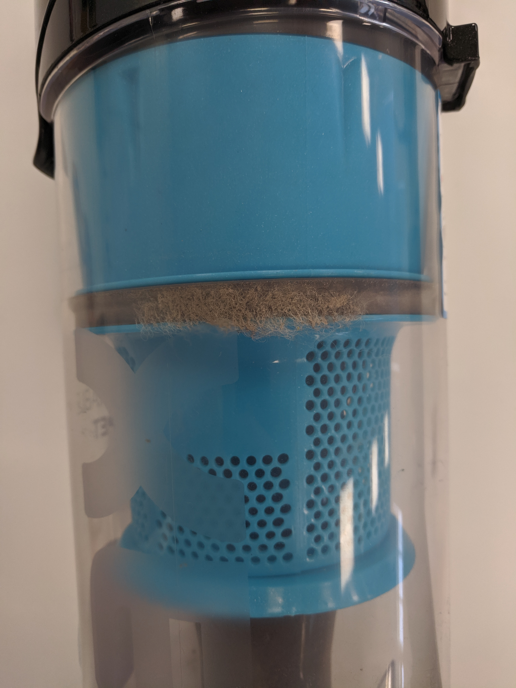
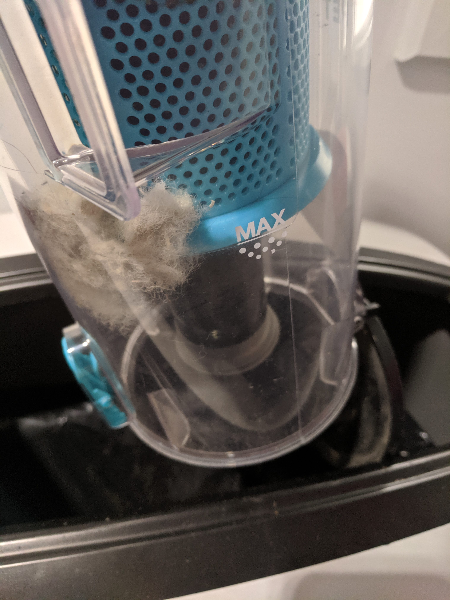
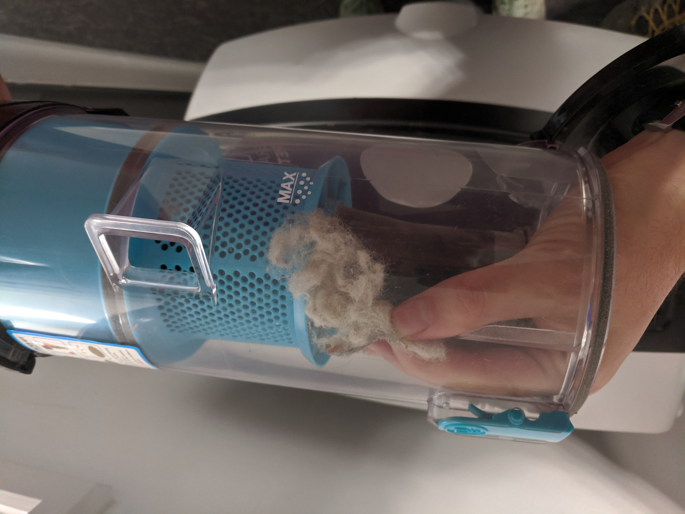
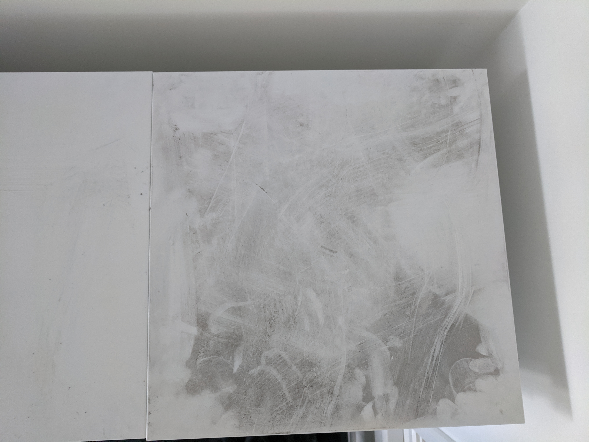
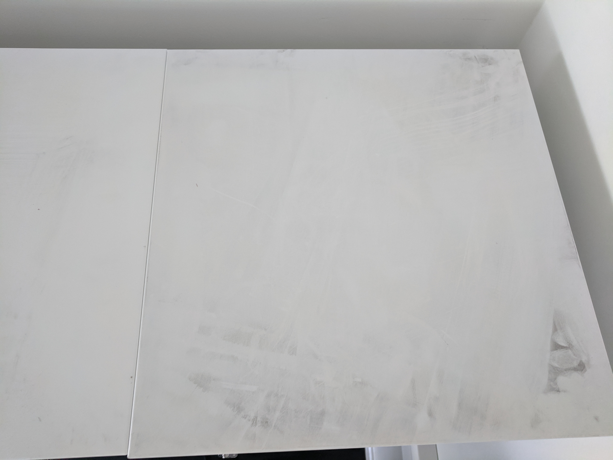

# Performance

## Testing Turbo Cleaner

Animal hair on chair fabric

Clean fabric

After cleaning with turbo tool

After cleaning with upholstery tool

## Emptying after use

Areas where dirt becomes lodged

Some hair became stuck and needed manual removal

## Testing hard floors

The top of the lockers in 4E 3.36 were a perfect candidate to test dirt that had not been placed loosly on top of a hard surface; as the tops of the lockers had ovbiously not been cleaned in some time.

Before

After
